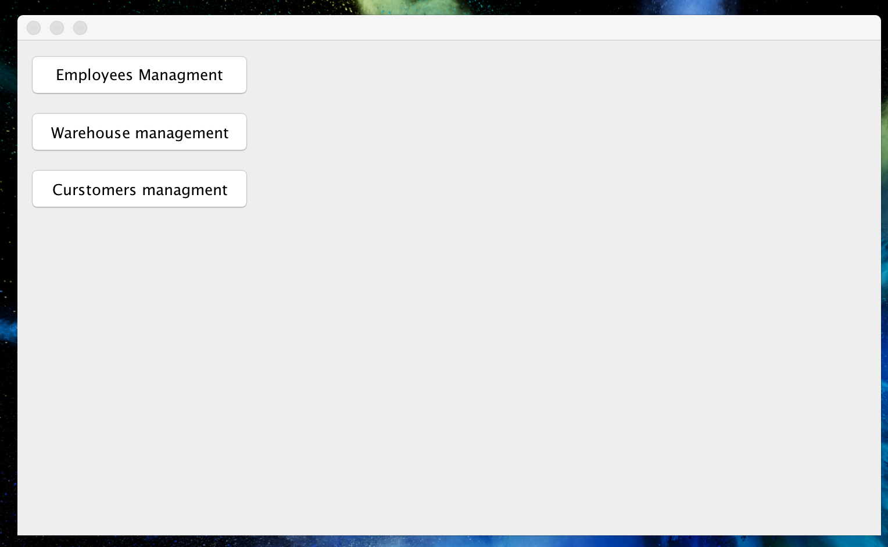
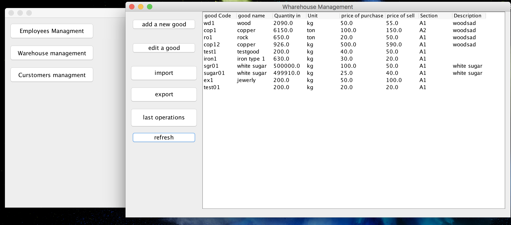
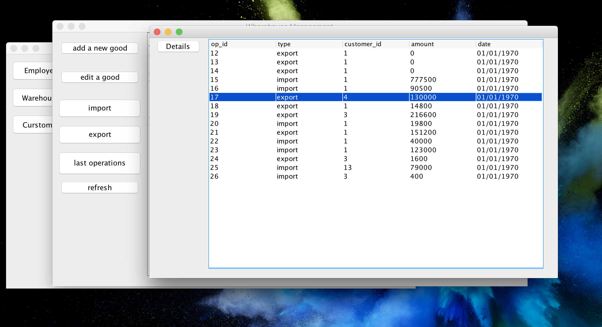
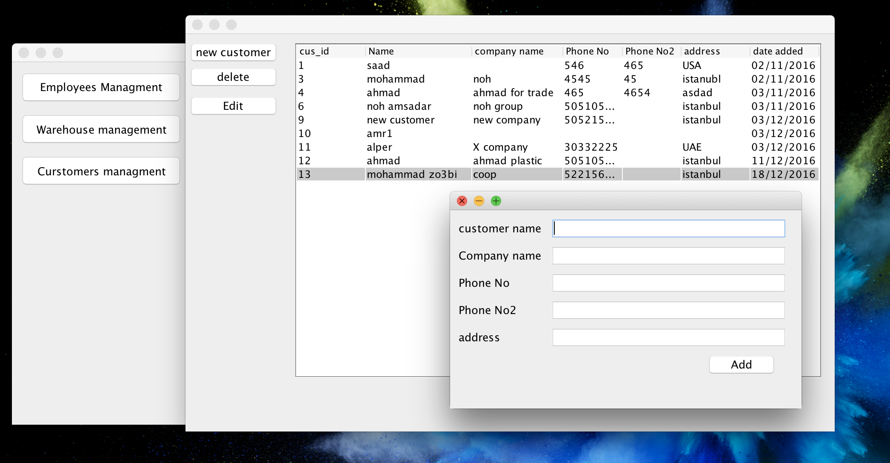
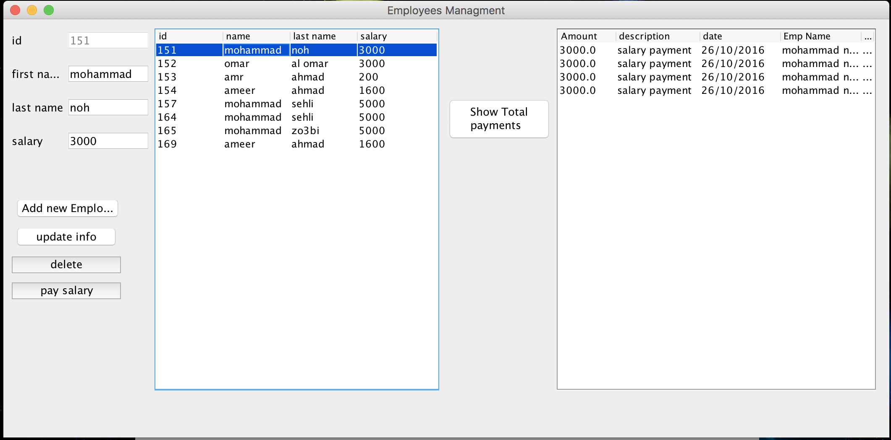

# mini-Company and warehouse Management system (CMS)
CMS is Desktop application with Basic features for management of Company's warehouse Sales and Employee information.

## How to run:
there is an executable version of the app as .jar file with a mock database, which you can run directly without the need to compile the source code.
 
1-download 'Java SE Runtime Environment' for your system (windows, mac, Linux (not tested yet)).

2-download the CMS_APP folder, open it and run the file "cms.jar".

## Main Features

### main interface

### 1-Wharehouse Management
display the availiable goods quantites and info

display the transactions of goods and with which customer.

### 2-Customers Management
-customers database (will be used to make transaction with customers also)

### 3-Employees Management
-display list of employees
-display the payments of each employee  

## Contributing
Pull requests are welcome. For major changes, please open an issue first to discuss what you would like to change.
Please make sure to update tests as appropriate.

## License
[MIT](https://choosealicense.com/licenses/mit/)
